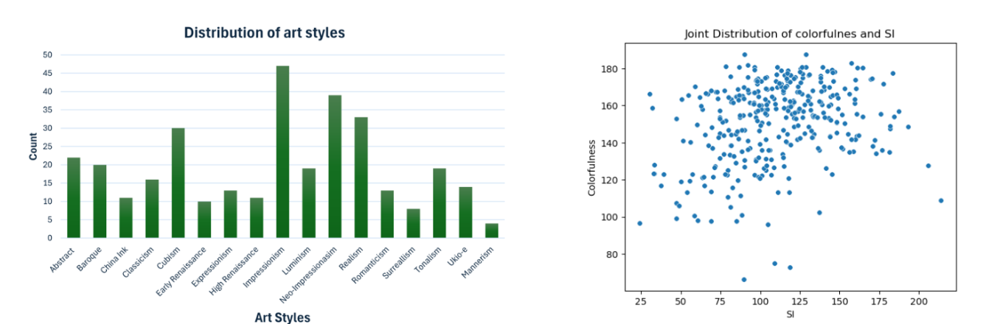
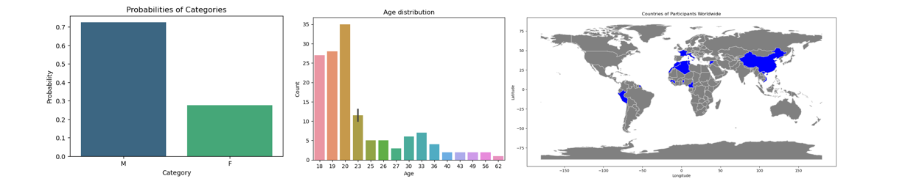
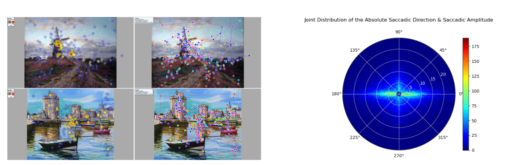

# AVAtt---Art-Visual-Attention
A visual attention dataset for art and paintings, providing scanpaths, and aggregated saliency maps. 

We present a new art and paintings dataset for visual attention

 Figure1. (a) Distribution of paintings chosen for the dataset based on styles, the dataset shows a diverse set of styles indicating the diversity and generalization ability of the dataset. (b) The joint distribution of Colorfulness and Spatial Information(SI) of the paintings in the dataset show a diversification in terms of texturization and color richness.

Figure 2: (a) Distribution of participants based on Gender  (b) Distribution Of participants based on Age. (c) Distribution of participants based on geographical origin. 

Figure 3: (a) Examples of Saliency maps and overlaid scanpaths over the images of the painting dataset.  (b) A histogram of  the distribution of saccadic amplitudes and directions.

